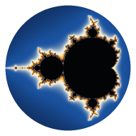

<p align="center"></p>

# Mathematische Visualisierung

Interaktive Visualisierung mathematischer Objekte im Browser – framework-frei, in **WebGL2** und
**TypeScript**. Jedes Bild entsteht im Fragment-Shader (bzw. als Dreiecksnetz für parametrische
Flächen); alle Module teilen sich eine gemeinsame Render-Infrastruktur.

## Module

| Modul | Inhalt |
| --- | --- |
| **Graphen** | Reelle Funktionen: `y = f(x)`, eigene Funktionen `f(x) = …` mit symbolischen Ableitungen `f'(x)`, `f''(x)`, implizite Kurven, Bereiche und Ungleichungsketten (`0 < y < 1 − x²`), Einschränkungen `sin(x) {0 < x < π}`, parametrische und polare Kurven, Punkte `(a, f(a))` und Wertzeilen. Funktionen: `|x|`, `x!`, `gamma`, `erf`, `floor`, `mod`, `min`/`max`, `asin` …, stückweise `if(…)`, `sum`/`prod`/`int` (ein Integral ohne x wird als Fläche gezeigt). Weitere Buchstaben werden Parameter mit Regler (einstellbarer Bereich, animierbar). Nullstellen (auch Berührstellen), Extrema und Schnittpunkte werden markiert. |
| **Komplex** | Domain Coloring komplexer Funktionen f(z): Farbton = arg f(z), Helligkeitsstufen = \|f(z)\| verdoppelt sich, optional Phasenlinien und z-Gitter. |
| **3D** | *Formen*: Raymarching über Distanzfelder (Torus, Doppeltorus, Torusknoten (p,q), Hopf-Ringe, Gyroid, Mandelbulb, Menger-Schwamm). *Implizit*: beliebige Flächen F(x,y,z) = 0. *Parametrisch*: Flächen (x,y,z)(u,v) wie Möbiusband oder Kleinsche Flasche – Rückseiten warm gefärbt. |
| **Hyperbolisch** | Parkettierungen {p,q} in Poincaré-Scheibe, Halbebene oder Klein-Modell; sieben uniforme Varianten per Wythoff-Konstruktion; Ziehen verschiebt hyperbolisch, „Bewegen“ gleitet entlang einer Geodäte. |
| **Mandelbrot** | Deep Zoom bis ~10⁻²⁹⁰ per Störungsrechnung mit Referenzorbit in beliebiger Präzision; „Minibrot suchen“ findet per Newton-Verfahren Mini-Mandelbrots als Zoomziele. |
| **Topologie** | *Polygone*: 2-dimensionale CW-Komplexe aus Kantenwörtern (`a b a⁻¹ b⁻¹`, mehrere Polygone, beliebige Vielfachheiten) mit Diagramm, Flächenerkennung über Ecken-Links, Klassifikation und Verklebe-Animation. *Räume*: CW-Räume beliebiger Dimension per Ausdruck – Sⁿ, Dⁿ, Tⁿ, ℝPⁿ, ℂPⁿ, K, Möbiusband, L(p,q), M(n,k), F(g), N(k), Poincaré-Sphäre und Präsentationskomplexe `⟨a, b | a², b³⟩` mit ∨, #, ×, ∧, Σ, ⊔, Rand `∂X`, Kegel, Verbund, Zellen anheften (`∪ e²(2)`) und Quotienten (`/ ∂`, `/ sk(1)`); Keilprodukte als 3D-Blumenstrauß, sonst Zellstruktur mit Randabbildungen. *Simplizial*: Facettenlisten (z. B. 7-Ecken-Torus, 6-Ecken-ℝP²) mit drehbarem 3D-Modell. Überall exakte Homologie Hₖ über ℤ (Smith-Normalform), Kohomologie, Randmatrizen, χ, Poincaré-Polynom und π₁: vereinfacht (Tietze), erkannt (frei, abelsch, Flächengruppe, freies Produkt) und bei endlichen Gruppen per Todd–Coxeter gezählt. |

## Bedienung

- **Maus / Touch**: Ziehen verschiebt (im 3D-Modul: dreht), Mausrad bzw. zwei Finger zoomen um den Cursor.
- **Tastatur**: `H` Panel ein/aus · `R` Ansicht zurücksetzen · `L` Link kopieren · `A` Achsen.
- **⊹ Achsen**: beschriftete Achsen (2D: Re/Im bzw. x/y, 3D: x/y/z perspektivisch); bei tiefem Zoom
  automatisch als Abstand Δ zur Bildmitte. Die Achsen werden in den PNG-Export übernommen.
- **⧉ Link**: Der gesamte Zustand steht im URL-Hash – Links lassen sich teilen und stellen Ansicht und Einstellungen exakt wieder her (beim Mandelbrot inklusive der Bildmitte in voller Präzision).
- **⤓ Export**: PNG in 1×–8× der Bildschirmauflösung, optional 2× überabgetastet (Kantenglättung); gerendert wird in Kacheln.
- **Offline**: Als Web-App installierbar (PWA), läuft nach dem ersten Besuch ohne Netz.

### Formelsyntax

`+ − * / ^`, Klammern, implizite Multiplikation (`2z`, `3(z+1)`, `xy`, `iz`), `x²`.
Konstanten `pi`, `e` (und `i` bei f(z)); Funktionen `exp log ln sqrt sin cos tan sinh cosh tanh abs`,
für f(z) zusätzlich `conj re im`. `^` ist rechtsassoziativ, `−z^2 = −(z²)`. Implizite Flächen
akzeptieren Gleichungen `links = rechts`.

## Technik

```
src/
  core/        gl.ts (Kompilieren, Fehler → Zeilennummern), renderer.ts (Fullscreen-Triangle,
               Render-on-Demand, progressive Auflösung, gekachelter Export), view.ts (Pan/Zoom/Pinch),
               prelude.glsl (gemeinsame Shader-Präambel), tiles.ts
  math/        parser.ts (Tokenizer → Recursive Descent → AST), real.ts / complex.ts (Codegen + Referenz),
               diff.ts (symbolisches Ableiten, Einsetzen eigener Funktionen)
  modules/     plot, domain, shapes, hyperbolic, mandelbrot, topology, grid (Testmodul, nur per #m=grid)
  ui/          Panel, Formelfelder, Widgets, URL-Zustand, Achsen (Beschriftungsebene)
```

- **Render-on-Demand**: gezeichnet wird nur bei Zustandsänderung (Dirty-Flag + requestAnimationFrame).
- **Progressive Auflösung**: Die GPU-Dauer eines vollen Frames wird per Fence gemessen; ist sie hoch,
  wird während der Interaktion in reduzierter Auflösung gerendert und hochskaliert, 180 ms nach dem
  Loslassen wieder voll.
- **Genauigkeit**: Das Ansichtszentrum liegt in double (Mandelbrot: bigint-Anker + double-Offset),
  Shader rechnen nur mit lokalen, kleinen Koordinaten.
- **Shader-Hot-Reload** über Vites HMR (`import src from './x.frag?raw'`).
- Keine Laufzeit-Abhängigkeiten; Entwicklung mit Vite, TypeScript (strict) und Vitest.

### Mathematik in Kürze

- **Domain Coloring**: box-gefilterter Sägezahn für die Modulus-Konturen (analytisches Antialiasing),
  Phasenableitung über (w × dw)/|w|², stetig über den Verzweigungsschnitt.
- **Hyperbolisch**: Faltung jedes Pixels ins Fundamentaldreieck (π/p, π/q, π/2) mit dem zum
  Einheitskreis orthogonalen Spiegelkreis (d² = r² + 1); Disk-Automorphismen als SU(1,1)-Matrizen,
  nach jedem Schritt per Symmetrie der Parkettierung zurückgeführt (sonst wächst |α| exponentiell).
- **Topologie**: zelluläre Kettenkomplexe über ℤ, Homologie per Smith-Normalform (Torsion
  inklusive), Kohomologie per universellem Koeffiziententheorem; Produkte mit Koszul-Vorzeichen
  (Künneth samt Tor-Termen stimmt), reduzierte Suspension, Keil, zusammenhängende Summe.
  Polygone: Eckklassen per Union-Find, Flächenerkennung über die Links der Ecken, Orientierbarkeit
  als 2-Färbung, π₁ über einen Spannbaum des 1-Skeletts. Räume führen neben dem Kettenkomplex eine
  π₁-Präsentation mit (van Kampen: ∨ → freies Produkt, × → direktes Produkt, # → Wortverkettung bzw.
  freies Produkt) und den Rand als Teilkomplex (für ∂X und X/∂). Gruppen: Tietze-Transformationen,
  Abelisierung per Smith-Normalform, Todd–Coxeter (HLT mit Koinzidenzen) für die Ordnung.
- **Graphen**: strenge Semantik (sqrt, ln, asin … außerhalb des Definitionsbereichs undefiniert,
  x^(p/q) für x < 0 nur bei ungeradem q); Ausdrücke werden zu Closures kompiliert. Explizite Kurven
  werden adaptiv abgetastet (Polstellen und Ränder des Definitionsbereichs per Bisektion), implizite
  Kurven und Bereiche im Shader über |F|/|∇F|. Integrale per Tanh-Sinh-Quadratur (verträgt
  Randsingularitäten), Γ per Stirling-Reihe, erf per Reihe bzw. Kettenbruch.
- **Mandelbrot**: δ_{n+1} = 2Z_nδ_n + δ_n² + δc in float, unterhalb 2⁻¹⁰⁰ als Mantisse/Exponent;
  Rebasing nach Zhuoran, Glitch-Erkennung nach Pauldelbrot (zum Vergleich einblendbar);
  Innen-Erkennung über Konvergenz an aufeinanderfolgenden Rebasings. Minibrot-Suche: Ball-Perioden-
  erkennung, Newton auf z_p(c) = 0 in Festkomma, Größe 1/(β·λ²).

## Entwicklung

```bash
npm install
npm run dev        # Entwicklungsserver mit Shader-Hot-Reload
npm test           # Unit-Tests (Parser, Codegen, Geometrie, Störungsrechnung, …)
npm run build      # Typecheck + Produktions-Build nach dist/
npm run preview    # Build lokal ansehen (inkl. Service Worker)
npm run icons      # App-Icons neu erzeugen
```

Der Build verwendet relative Pfade und läuft in jedem Unterverzeichnis. Ein Push auf `main` baut und
veröffentlicht die Seite über GitHub Pages (`.github/workflows/deploy.yml`), sofern Pages im
Repository auf „GitHub Actions“ gestellt ist.

## Grenzen und Ausblick

- Sehr tiefe Minibrots (Periode > 2000) sind ohne **Bilinear-Approximation (BLA)** zu rechenintensiv;
  die Minibrot-Suche ist darauf begrenzt. BLA wäre der nächste Schritt für den Deep Zoom.
- Die float-Präzision des Referenzorbits verursacht an chaotischen Rändern vereinzelt abweichende
  Iterationszahlen (Test im Seepferdchental bei 1e-9: ~94 % der Pixel auf ±2 Iterationen exakt).
- Implizite Flächen ohne Schatten; das Klein-Modell nutzt eine genäherte Kantenglättung.
